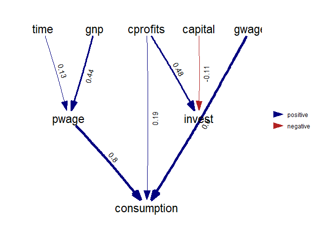
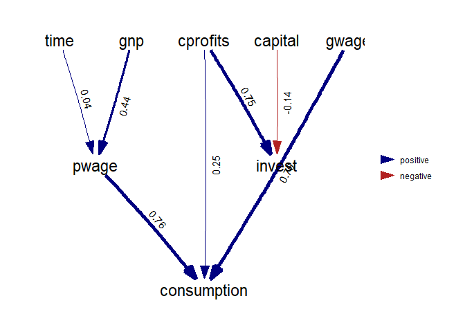
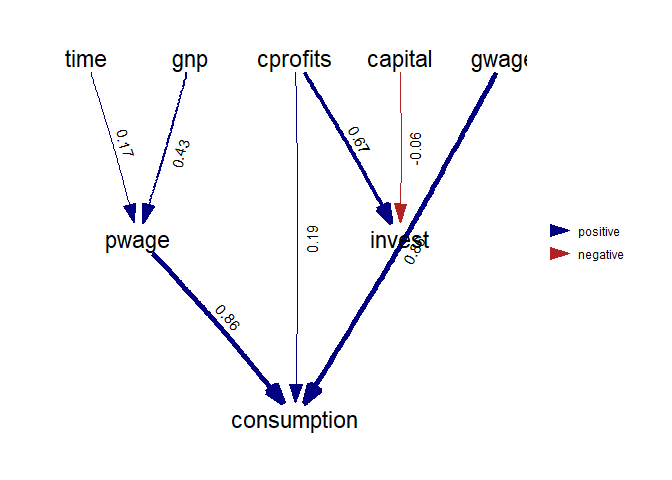

<!-- README.md is generated from README.Rmd. Please edit that file -->

# testingdsem

<!-- badges: start -->
<!-- badges: end -->

test to make sure dsem output is consistent

## Installation

You can install the development version of testingdsem from
[GitHub](https://github.com/) with:

``` r
# install.packages("devtools")
devtools::install_github("andybeet/testingdsem")
```

## Results

-   See figures below

-   Each figure shows a fitted network as found in the dsem
    [vignette](https://james-thorson-noaa.github.io/dsem/articles/vignette.html#comparison-with-dynamic-linear-models)

-   The original model fit is show with 3 other fits where the only
    difference is that some data have been set to missing (NAs)

-   Each of the three figures show three random assignments of NAs. In
    each case 25% of the data was assigned missing.

-   The parameters seem to be estimated ok, the algorithm seems to have
    converged ok, and the parameters that look quite different are
    statistically significant.

-   Note in particular the paths time-\>pwage and cprofits-\>invest

## Example

Fit from vignette

``` r
library(testingdsem)
plotid <- testJim()
#> 1 regions found.
#> Using 1 threads
#> 1 regions found.
#> Using 1 threads
plotid$porig
```



Fits of same model with missing data

``` r
plotid$p1
```


``` r
plotid$p2
```



``` r
plotid$p3
```


